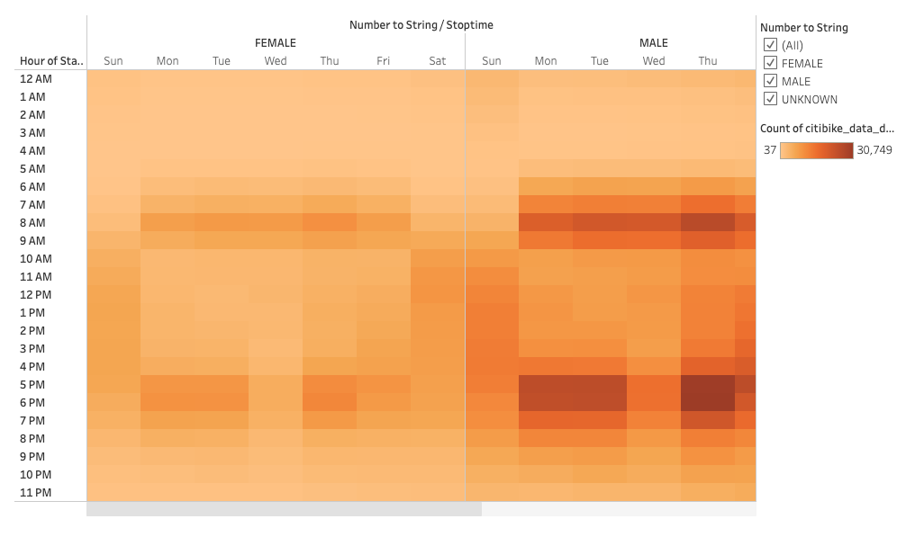

# NYC CitiBike Analysis
## Link to Dashboard
[Link to Dashboard](https://public.tableau.com/app/profile/amir.shirazi/viz/bikesharing_16259568928530/Story1)

## Purpose
The purpose of this project was to analyze and create easy-to-understand visualizations of NYC's CitiBike bike-share program to see if it would translate well to recreate in Des Moines, Iowa.

## Results
### The Questions
We focused on the following questions when analyzing and creating the visualizations:
1. Where do users start and end their rides the most? Is it in the center of the city or the outer boroughs?
2. How long are users using their bikes (in general and if there is a significant difference by gender)?
3. When are users picking up their bikes (in general and if there is a significant difference by gender)?
4. What type of user is using the bikes (subscriber or one-time payment customer)?

### The Answers
1. This visualization shows where users start or end their rides.

    

2. These visualizations show the number of users and the amount of time that each particular rider uses the bike for by hour and minutes per hour. The first shows general users and the second shows users by gender.

    
    

3. These visualizations show the number of users that check bikes out each hour of each day of the week. The first shows general users and the second shows users by gender.

    
    

4. This visualization shows the number of users, separated by user type (one-time payment customer and subscriber), that use CitiBikes each day of the week.

    

## Summary
Top Takeaways if we choose to pursue Des Moines:
1. CitiBikes are by and large mostly used for commuting. While some people use their bikes for pleasure, most rides take place Monday through Friday and before and after starting their 9 to 5's.
2. Bikes are checked out mostly in the central parts of NYC, therefore Des Moines should focus on positioning the majority of their bikes in the parts of the city that have the most 9 to 5 workers with the remaining bikes sparsed throughout the other parts of the city.

Visualization Suggestions:
1. Using a map visualization, measure how long people's trips are by distance.
2. Create a visualization to show how many people of each gender and age check out bikes.